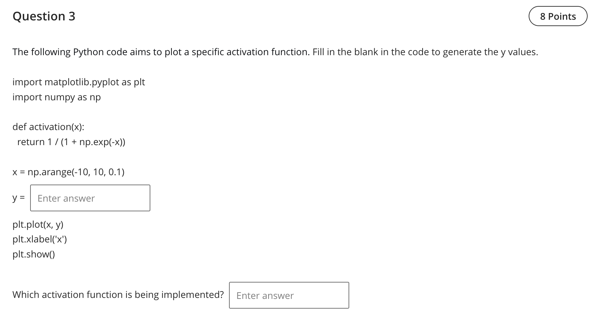

Question 3 — Fill the code and name the activation

- Final answers
  - y = activation(x)
  - Activation function name: Sigmoid

Explanation
- The function body `1 / (1 + np.exp(-x))` is the logistic sigmoid. To create the plotted `y` values we call it on `x` and plot.

References (lectures/practicals used)
- practicals/Pratice -W2 solution.pdf — p.3 (Sigmoid function implementation/plot)
- lectures/Lecture 2 - 2025.pdf — p.2 (activation functions overview including sigmoid)

