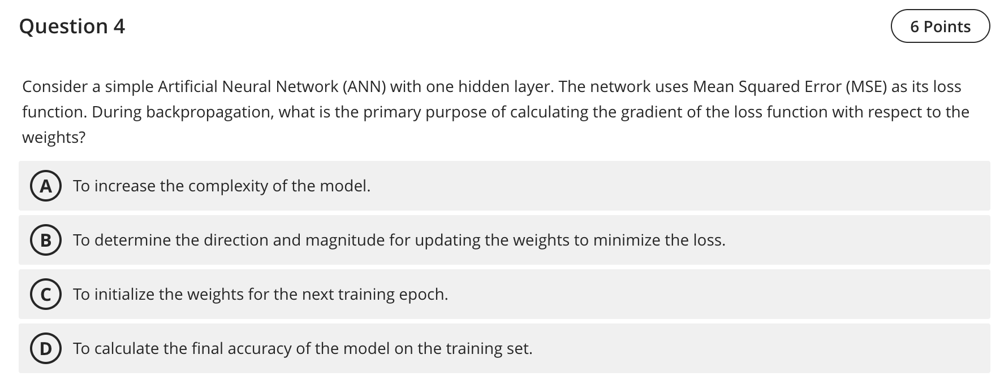

Question 4 — Role of gradients during backpropagation

- Final answer: B — To determine the direction and magnitude for updating the weights to minimize the loss.

Explanation
- Backpropagation computes the gradient of the loss with respect to each weight. The gradient indicates both the direction and step size (paired with a learning rate/optimizer) for weight updates that reduce the loss.

References (lectures/practicals used)
- lectures/Lecture 4 - 2025.pdf — p.6 (chain rule/gradients used for updating parameters)
- lectures/Lecture 2 - 2025.pdf — p.3 (error/gradient concept in learning)

