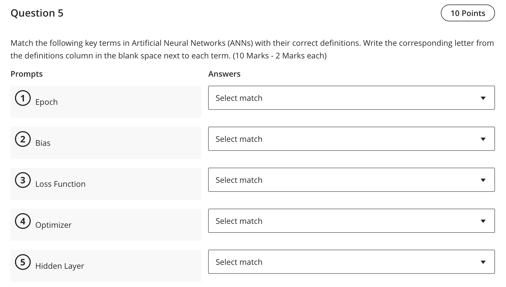

Question 5 — Match ANN terms to definitions

- Final matches (definitions written explicitly):
  - Epoch: one full pass over the entire training dataset.
  - Bias: a trainable offset added to the weighted sum before activation.
  - Loss Function: a measure of prediction error to be minimized (objective).
  - Optimizer: the algorithm that updates weights/biases using gradients (e.g., SGD/Adam).
  - Hidden Layer: any layer between the input and output layers.

References (lectures/practicals used)
- lectures/Lecture 3-2025.pdf — p.5–6 (Keras training loop: compile/fit/evaluate concepts)
- practicals/Practice - W5-r Answers.pdf — p.3 (compile and train settings: optimizer/loss)
- practicals/Pratice -W2 solution.pdf — p.1 (ANN components including bias/hidden layer)

