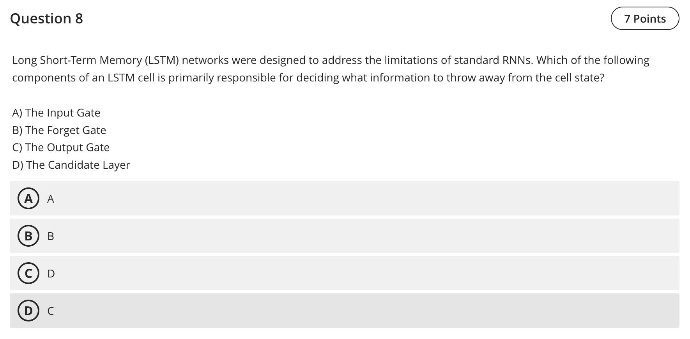

Question 8 — LSTM: which component decides what to forget?

- Final answer: B — The Forget Gate

Explanation
- In an LSTM cell, the forget gate controls how much of the cell state is erased (what information to throw away) at each timestep.

References (lectures/practicals used)
- lectures/Lecture 6 - 2025.pdf — p.2–4 (RNN/LSTM overview)
- practicals/Practice - W6 Answers.pdf — p.4 (RNN building blocks and discussion around gating/activations)

