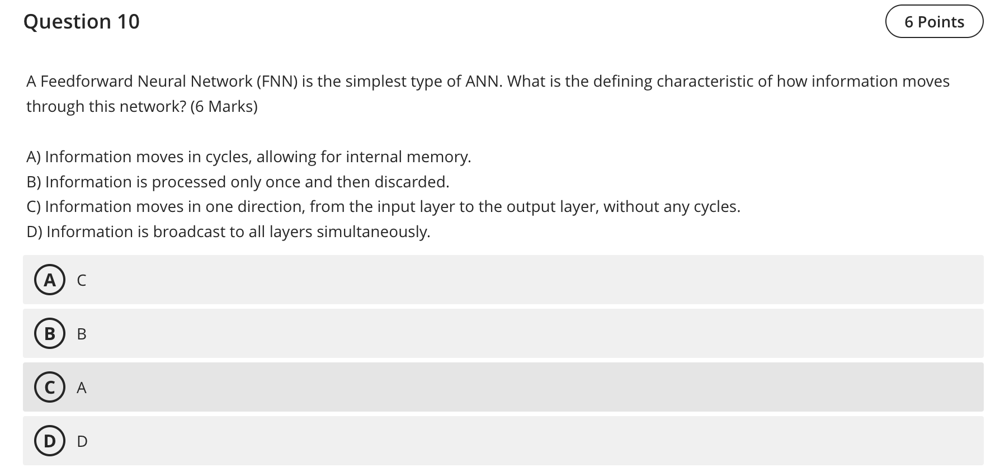

Question 10 — Property of a Feedforward Neural Network (FNN)

- Final answer: C — Information flows in one direction, from input to output, with no cycles.

Explanation
- An FNN does not contain feedback connections; signals pass forward layer‑by‑layer until the output layer.

References (lectures/practicals used)
- lectures/Lecture 3-2025.pdf — p.5 (MLP/Feed‑forward model description)

