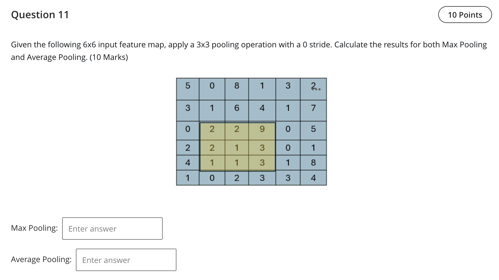

Question 11 — 3×3 pooling over the highlighted region

Highlighted 3×3 values:
```
2 2 9
2 1 3
1 1 3
```

- Max pooling result: 9
- Average pooling result: (2+2+9+2+1+3+1+1+3) / 9 = 24/9 = 2.67

References (lectures/practicals used)
- lectures/Lecture 7 - 2025.pdf — p.3–6 (pooling types and examples)

