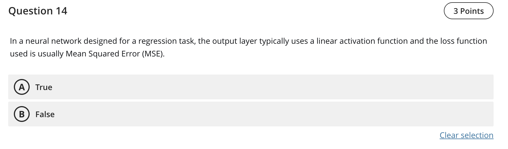

Question 14 — Regression head activation and loss

- Final answer: True

Explanation
- For standard regression to real‑valued targets, a linear activation is typically used in the output layer so the network can predict any real value, and Mean Squared Error (MSE) (or MAE) is a common loss choice.

References (lectures/practicals used)
- lectures/Lecture 3-2025.pdf — p.5 (examples with regression heads)

