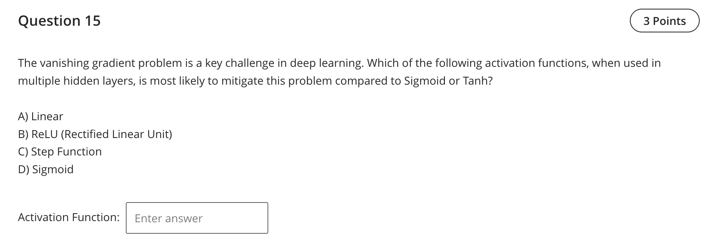

Question 15 — Activation that mitigates vanishing gradients

- Final answer: ReLU (Rectified Linear Unit)

Explanation
- Compared to sigmoid/tanh, ReLU has unit slope for positive inputs and avoids saturation in that region, which helps gradients propagate through many layers, mitigating vanishing gradients in deep networks.

References (lectures/practicals used)
- lectures/Lecture 2 - 2025.pdf — p.2 (activation functions including ReLU)
- lectures/Lecture 3-2025.pdf — p.5 (deep MLPs commonly using ReLU)

