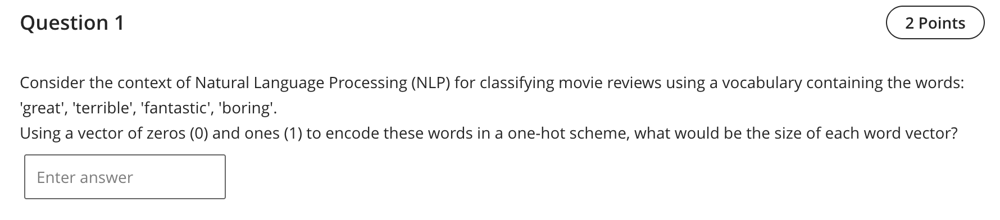

Question 1 — One‑hot vector size

- Final answer: 4

Detailed explanation
- In one‑hot encoding, the dimensionality of each word vector equals the vocabulary size.
- The vocabulary shown in the prompt contains exactly four distinct tokens: “great”, “terrible”, “fantastic”, and “boring”. Therefore, the one‑hot vector must be length 4.
- Example encodings (one possible assignment):
  - great → [1, 0, 0, 0]
  - terrible → [0, 1, 0, 0]
  - fantastic → [0, 0, 1, 0]
  - boring → [0, 0, 0, 1]

References (lectures/practicals used)
- lectures/Lecture 2 - 2025.pdf — p.2 (feature representations overview; basis for one‑hot idea)
- practicals/Practice - W3 - Answer.pdf — p.3 (Label encoding for categorical targets prior to model training)
