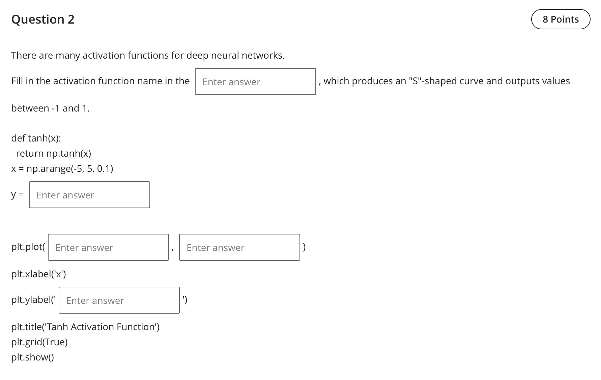

Question 2 — Activation function and plotting blanks

Filled blanks
- Activation function name: tanh
- y = tanh(x)
- plt.plot(x, y)
- plt.ylabel('tanh(x)')

Why “tanh” here?
- The prompt asks for an activation that “produces an S‑shaped curve and outputs values between −1 and 1”. The hyperbolic tangent function satisfies both: tanh: ℝ → (−1, 1) with an S‑shape similar to logistic but centered at 0.

Complete runnable snippet
```python
import numpy as np
import matplotlib.pyplot as plt

def tanh(x):
    return np.tanh(x)

x = np.arange(-5, 5, 0.1)
y = tanh(x)

plt.plot(x, y)
plt.xlabel('x')
plt.ylabel('tanh(x)')
plt.title('Tanh Activation Function')
plt.grid(True)
plt.show()
```

References (lectures/practicals used)
- lectures/Lecture 2 - 2025.pdf — p.2 (activation functions overview)
- lectures/Lecture 6 - 2025.pdf — p.2–4 (activation functions incl. tanh)
- practicals/Practice - W6 Answers.pdf — p.4 (adding tanh activation in RNN exercise)
