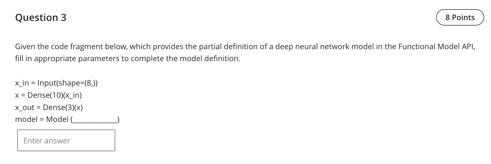

Question 3 — Keras Functional API model()

- Final fill: Model(inputs=x_in, outputs=x_out)

Detailed explanation
- The snippet defines a tensor pipeline using the Keras Functional API:
  - `x_in = Input(shape=(8,))`
  - `x = Dense(10)(x_in)`
  - `x_out = Dense(3)(x)`
- To create the model object in this API you must pass both the input and output tensors to `Model` so Keras can build the computation graph from `x_in` to `x_out`.

References (lectures/practicals used)
- lectures/Lecture 3-2025.pdf — p.3–4 (Keras Functional API usage examples)
- practicals/Practice - W4 - Answers.pdf — p.3 (exercise explicitly using Functional model)
