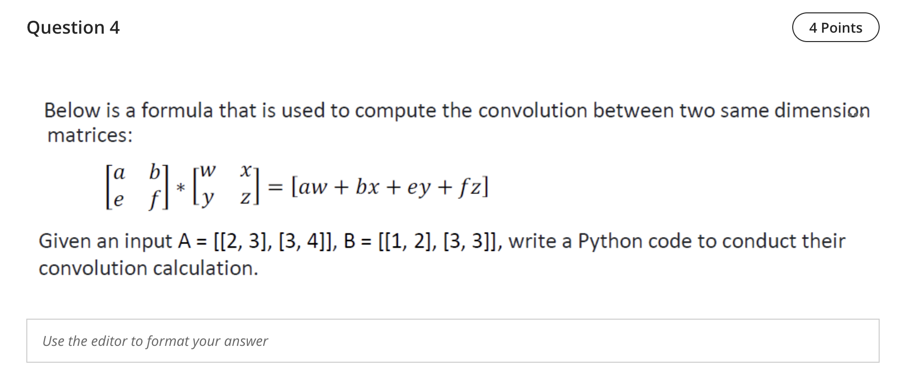

Question 4 — Convolution between two same‑size matrices (elementwise product then sum)

Derivation from the provided formula
- The figure shows two 2×2 matrices multiplied elementwise and summed: [a b; e f] * [w x; y z] = (a·w + b·x + e·y + f·z).
- From the prompt values: A = [[2, 3],[3, 4]] and B = [[1, 2],[3, 3]]. Therefore,
  - a=2, b=3, e=3, f=4 and w=1, x=2, y=3, z=3.
- Compute: 2·1 + 3·2 + 3·3 + 4·3 = 2 + 6 + 9 + 12 = 29.

Python check
```python
import numpy as np
A = np.array([[2, 3],[3, 4]])
B = np.array([[1, 2],[3, 3]])
print(np.sum(A*B))  # 29
```

Final answer
- 29

References (lectures/practicals used)
- lectures/Lecture 7 - 2025.pdf — p.1–3 (convolution/kernels and pooling intro)
- practicals/Practice - W1 Answers-r (1).pdf — p.1 (convolution between two same‑size matrices example and solution)
