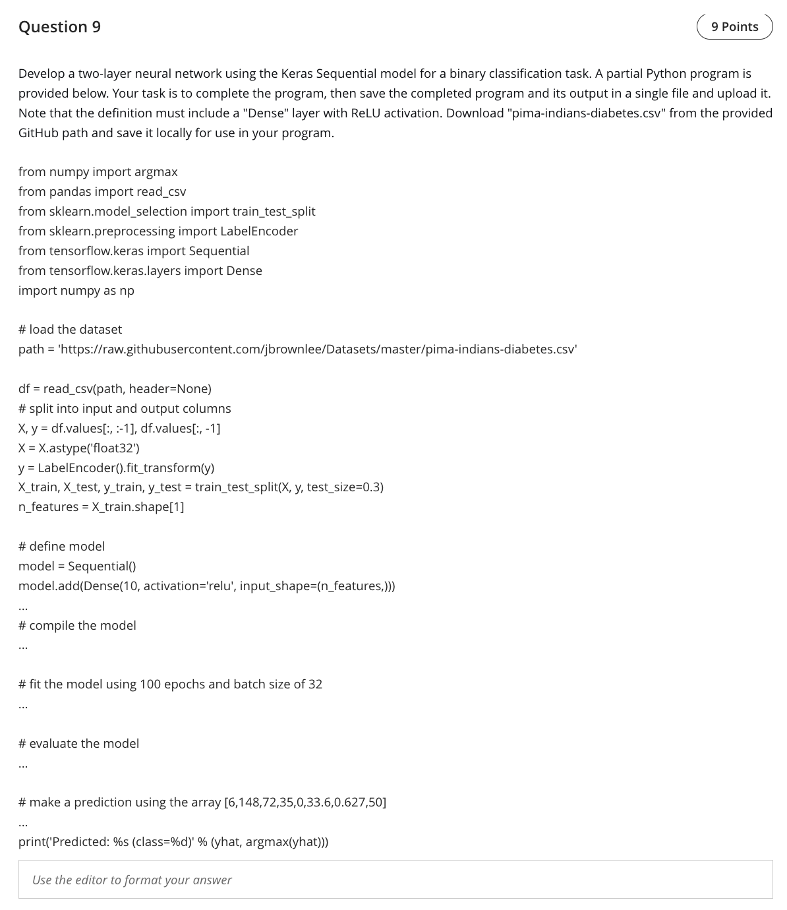

Question 9 — Two‑layer Keras Sequential model (binary task)

Rationale
- The screenshot asks for a two‑layer network and ends by using `argmax(yhat)` to print a class ID. To keep that output shape consistent with `argmax`, the solution uses a 2‑unit softmax output and trains with `sparse_categorical_crossentropy`. (An equivalent alternative is a 1‑unit sigmoid with a ≥0.5 threshold.)

Complete program
```python
from numpy import argmax
from pandas import read_csv
from sklearn.model_selection import train_test_split
from sklearn.preprocessing import LabelEncoder
from tensorflow.keras import Sequential
from tensorflow.keras.layers import Dense
import numpy as np

# load the dataset
path = 'https://raw.githubusercontent.com/jbrownlee/Datasets/master/pima-indians-diabetes.csv'
df = read_csv(path, header=None)

# split into input and output columns
X, y = df.values[:, :-1], df.values[:, -1]
X = X.astype('float32')
y = LabelEncoder().fit_transform(y)

X_train, X_test, y_train, y_test = train_test_split(X, y, test_size=0.3, random_state=42)
n_features = X_train.shape[1]

# define model: Dense with ReLU, then 2‑unit softmax output
model = Sequential()
model.add(Dense(10, activation='relu', input_shape=(n_features,)))
model.add(Dense(2, activation='softmax'))

# compile
model.compile(optimizer='adam',
              loss='sparse_categorical_crossentropy',
              metrics=['accuracy'])

# fit for 100 epochs, batch size 32
model.fit(X_train, y_train, epochs=100, batch_size=32, verbose=0)

# evaluate
loss, acc = model.evaluate(X_test, y_test, verbose=0)
print(f'test loss={loss:.4f}, acc={acc:.4f}')

# make a prediction
sample = np.array([[6,148,72,35,0,33.6,0.627,50]], dtype='float32')
yhat = model.predict(sample, verbose=0)
print('Predicted:', yhat, '(class=%d)' % argmax(yhat))
```

References (lectures/practicals used)
- practicals/Practice - W5-r Answers.pdf — p.2–3 (classification compile/predict template used here)
- lectures/Lecture 3-2025.pdf — p.5–6 (classification network patterns; softmax vs sigmoid discussion)
