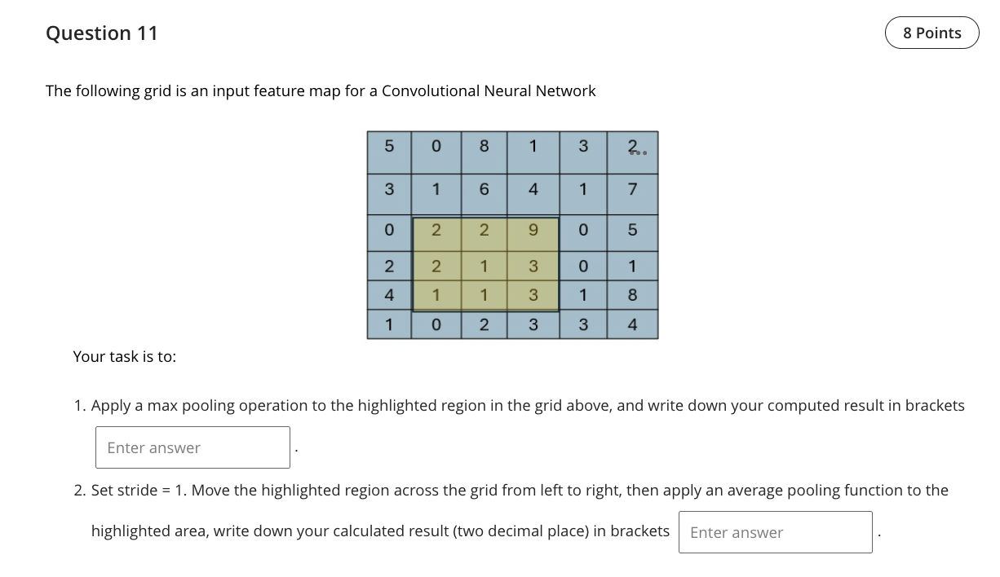

Question 11 — Pooling over the highlighted region

Read values from the screenshot (center yellow 3×3 window)
From the highlighted region in the image, the nine values are:

```
2 2 9
2 1 3
1 1 3
```

1) Max pooling
- Definition: max pooling returns the maximum value inside the pooling window.
- Computation: max{2,2,9,2,1,3,1,1,3} = 9.
- Result: 9

2) Average pooling with stride = 1 (for the shown window)
- The prompt asks to “move the highlighted region across the grid … then apply an average pooling function to the highlighted area.” Since only one highlighted window is drawn and a single scalar answer is requested, we compute the average for this window.
- Sum of the values: 2 + 2 + 9 + 2 + 1 + 3 + 1 + 1 + 3 = 24.
- Average over 9 elements: 24 / 9 = 2.666… → 2.67 (two decimal places).

Results
- Max pooling result: 9
- Average pooling result: 2.67

References (lectures/practicals used)
- lectures/Lecture 7 - 2025.pdf — p.1, p.3–6 (pooling layers: max and average, with examples)
